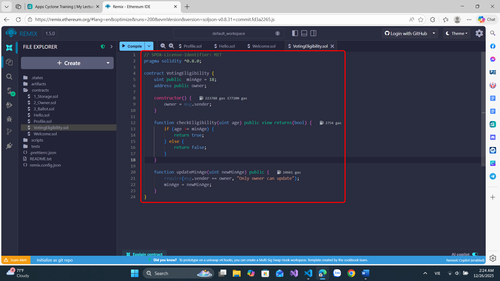
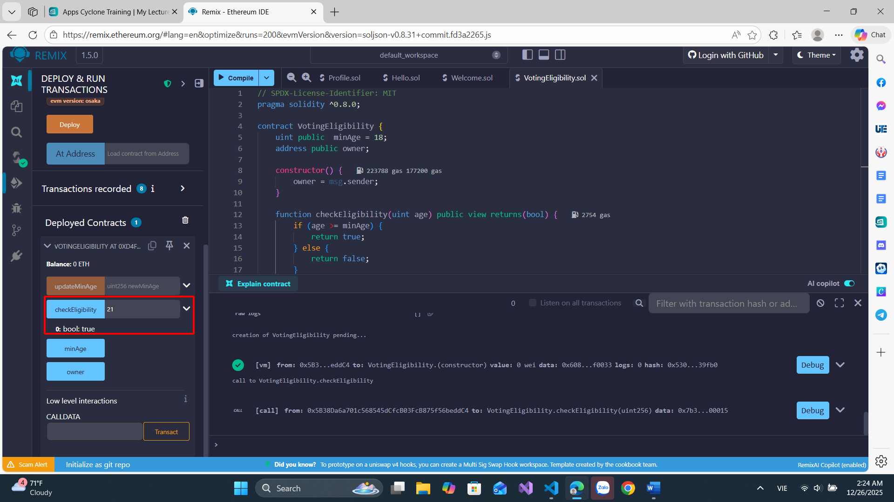
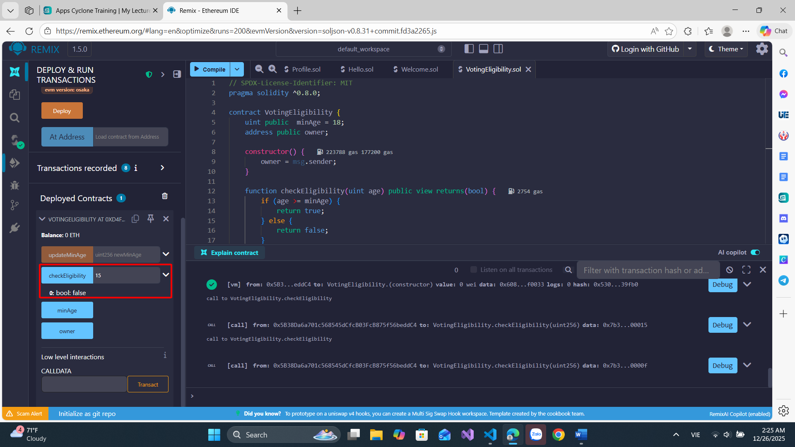
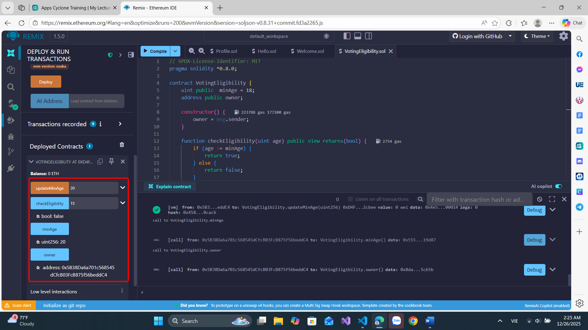

# Bài 3.2 – Hàm, Control Flow và Visibility

## 🎯 Mục tiêu
- Luyện tập định nghĩa hàm Solidity.
- Sử dụng require, if/else, return, visibility.
- Hiểu cách validate dữ liệu trong smart contract.

## 📄 Đề bài
Viết một smart contract tên `VotingEligibility`:
- Biến `minAge` kiểu uint, giá trị khởi tạo = 18.
- Hàm `checkEligibility(uint age)` trả về true/false:
  - Nếu `age >= minAge` → trả về true.
  - Ngược lại → trả về false.
- Hàm `updateMinAge(uint newMinAge)`:
  - Chỉ cho phép người deploy gọi được (sử dụng require với `msg.sender`).
  - Cập nhật lại `minAge`.

## 💻 Cách chạy
- Dán vào Remix IDE: https://remix.ethereum.org
- Deploy, test `checkEligibility()` và `updateMinAge()`

