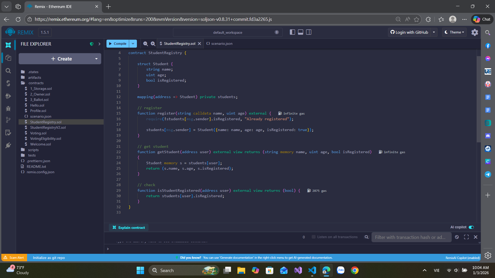

# Bài 4.1 – Mapping, Struct, Array

## 🎯 Mục tiêu
- Thực hành lưu trữ dữ liệu bằng struct, mapping.
- Biết cách thêm, đọc, kiểm tra dữ liệu trong smart contract.

## 📄 Đề bài
Viết một smart contract tên `StudentRegistry`:
- Tạo struct `Student` gồm: `name (string)`, `age (uint)`, `isRegistered (bool)`
- Dùng `mapping(address => Student)` để lưu thông tin từng người theo địa chỉ ví.
- Hàm `register(string name, uint age)` cho phép caller đăng ký bản thân.
- Hàm `getStudent(address user)` trả về thông tin student.
- Hàm `isStudentRegistered(address user)` trả về true/false nếu student đã đăng ký.

## 💻 Cách chạy
- Dán code vào Remix IDE: https://remix.ethereum.org
- Deploy, test lần lượt các hàm.
- Thử gọi `register()`, `getStudent()` và `isStudentRegistered()`.

## Code
// SPDX-License-Identifier: MIT
pragma solidity ^0.8.13;

contract StudentRegistry {

    struct Student {
        string name;
        uint age;
        bool isRegistered;
    }

    mapping(address => Student) private students;

    // register
    function register(string calldata name, uint age) external {
        require(!students[msg.sender].isRegistered, "Already registered");

        students[msg.sender] = Student({name: name, age: age, isRegistered: true
        });
    }

    // get student
    function getStudent(address user) external view returns (string memory name, uint age, bool isRegistered)
    {
        Student memory s = students[user];
        return (s.name, s.age, s.isRegistered);
    }

    // check
    function isStudentRegistered(address user) external view returns (bool) {
        return students[user].isRegistered;
    }
}
