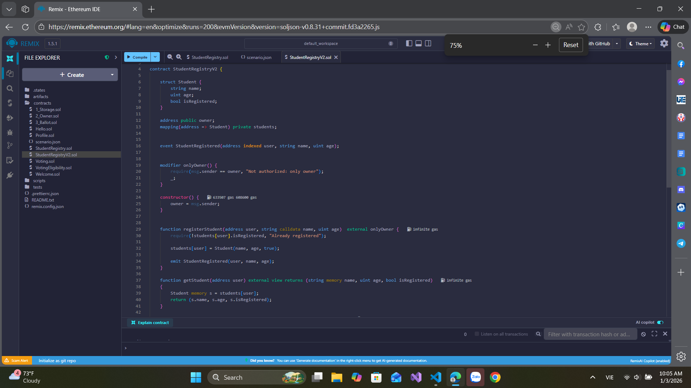

# Bài 4.2 – Modifier, Event và Quyền Truy Cập

## 🎯 Mục tiêu
- Thực hành viết modifier giới hạn quyền owner.
- Ghi log bằng event khi thêm dữ liệu.

## 📄 Đề bài
Viết một smart contract `StudentRegistryV2` mở rộng từ bài 4.1:
- Chỉ owner (người deploy contract) được phép thêm sinh viên.
- Khi thêm sinh viên thành công sẽ emit event.

## 💻 Cách chạy
- Dán code vào Remix IDE: https://remix.ethereum.org
- Deploy → Test `registerStudent()`, kiểm tra event log và kết quả đọc student.

## Code
// SPDX-License-Identifier: MIT
pragma solidity ^0.8.13;

contract StudentRegistryV2 {

    struct Student {
        string name;
        uint age;
        bool isRegistered;
    }

    address public owner;
    mapping(address => Student) private students;

    
    event StudentRegistered(address indexed user, string name, uint age);

   
    modifier onlyOwner() {
        require(msg.sender == owner, "Not authorized: only owner");
        _;
    }

    constructor() {
        owner = msg.sender; 
    }

    
    function registerStudent(address user, string calldata name, uint age)  external onlyOwner {
        require(!students[user].isRegistered, "Already registered");

        students[user] = Student(name, age, true);

        emit StudentRegistered(user, name, age);
    }

    function getStudent(address user) external view returns (string memory name, uint age, bool isRegistered)
    {
        Student memory s = students[user];
        return (s.name, s.age, s.isRegistered);
    }

    function isStudentRegistered(address user) external view returns (bool) {
        return students[user].isRegistered;
    }
}
