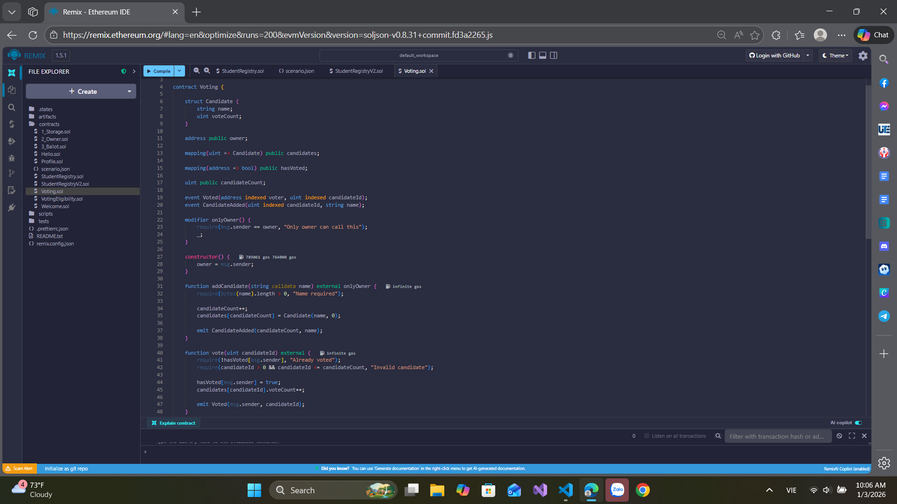

# Bài 4.3 – Voting Smart Contract

## 🎯 Mục tiêu
- Thực hành làm bài tập tổng hợp tuần 4.
- Kết hợp struct, mapping, modifier, event để xây dựng voting contract.

## 📄 Đề bài
Viết một smart contract `Voting`:
- Admin (owner) tạo danh sách ứng viên.
- Người dùng chỉ được vote 1 lần cho 1 ứng viên.
- Ghi log mỗi lần vote thành công bằng event.

### Yêu cầu:
1️⃣ Struct `Candidate` gồm `name (string)`, `voteCount (uint)`  
2️⃣ Mapping `candidates(uint => Candidate)`  
3️⃣ Mapping `hasVoted(address => bool)`  
4️⃣ Modifier `onlyOwner` để kiểm soát việc tạo ứng viên  
5️⃣ Event `Voted(address voter, uint candidateId)`

## 💻 Cách chạy
- Dán code vào Remix IDE: https://remix.ethereum.org
- Deploy → Thêm ứng viên → Thực hiện vote → Kiểm tra event log và kết quả đếm phiếu.

## Code
// SPDX-License-Identifier: MIT
pragma solidity ^0.8.13;

contract Voting {

    struct Candidate {
        string name;
        uint voteCount;
    }

    address public owner;

    mapping(uint => Candidate) public candidates;

    mapping(address => bool) public hasVoted;

    uint public candidateCount;

    event Voted(address indexed voter, uint indexed candidateId);
    event CandidateAdded(uint indexed candidateId, string name);

    modifier onlyOwner() {
        require(msg.sender == owner, "Only owner can call this");
        _;
    }

    constructor() {
        owner = msg.sender;
    }

    function addCandidate(string calldata name) external onlyOwner {
        require(bytes(name).length > 0, "Name required");

        candidateCount++;
        candidates[candidateCount] = Candidate(name, 0);

        emit CandidateAdded(candidateCount, name);
    }

    function vote(uint candidateId) external {
        require(!hasVoted[msg.sender], "Already voted");
        require(candidateId > 0 && candidateId <= candidateCount, "Invalid candidate");

        hasVoted[msg.sender] = true;
        candidates[candidateId].voteCount++;

        emit Voted(msg.sender, candidateId);
    }

    function getCandidate(uint candidateId) external view returns (string memory name, uint votes)
    {
        Candidate memory c = candidates[candidateId];
        return (c.name, c.voteCount);
    }
}
