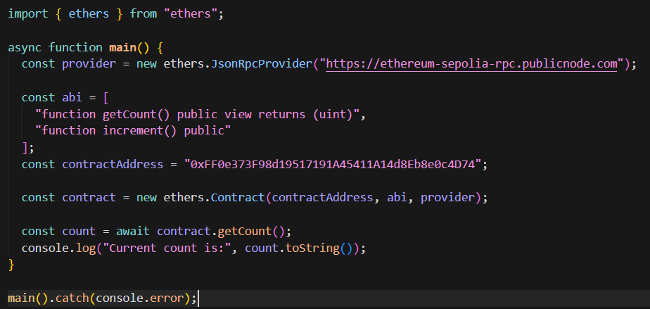
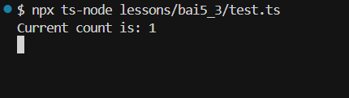

# Bài Tập 5.3 – Giao tiếp với smart contract qua ABI

🎯 Mục tiêu:
- Hiểu và sử dụng ABI để gọi hàm smart contract.
- Kết nối tới contract đã deploy sẵn và gọi hàm đọc.

---

## ✅ Yêu cầu

Giả sử có một contract `Counter` đã được deploy tại địa chỉ sau:
```
Contract Address: 0x1234567890abcdef1234567890abcdef12345678

Contract Address được deploy ở bai5_2 là: 0xFF0e373F98d19517191A45411A14d8Eb8e0c4D74

```

Và ABI như sau:
```ts
[
  "function getCount() public view returns (uint)",
  "function increment() public"
]
```

Viết đoạn script dùng ethers.js để:
1. Kết nối tới contract (dùng địa chỉ + ABI trên)

2. Gọi `getCount()` và in ra kết quả

---

## 💡 Gợi ý

- Dùng `new ethers.Contract(address, abi, providerOrSigner)`
- Nếu chỉ đọc (call view function) thì chỉ cần `provider`
- Gọi: `await contract.getCount()`

---

## 🧪 Chạy lệnh

```bash
npx ts-node test.ts
```
Bài 5.3 đã chạy thành công! Kết quả:
Current count is: 1
Giải thích:
- Script đã kết nối thành công với contract Counter tại địa chỉ 0xFF0e373F98d19517191A45411A14d8Eb8e0c4D74 (từ bài 5.2)
- Gọi hàm getCount() và nhận được giá trị 1
- Giá trị là 1 vì contract đã được gọi increment() một lần từ bài 5.2

✅ Nếu hiển thị được số đếm hiện tại → bạn đã hiểu đúng cách frontend dùng ABI để tương tác contract!